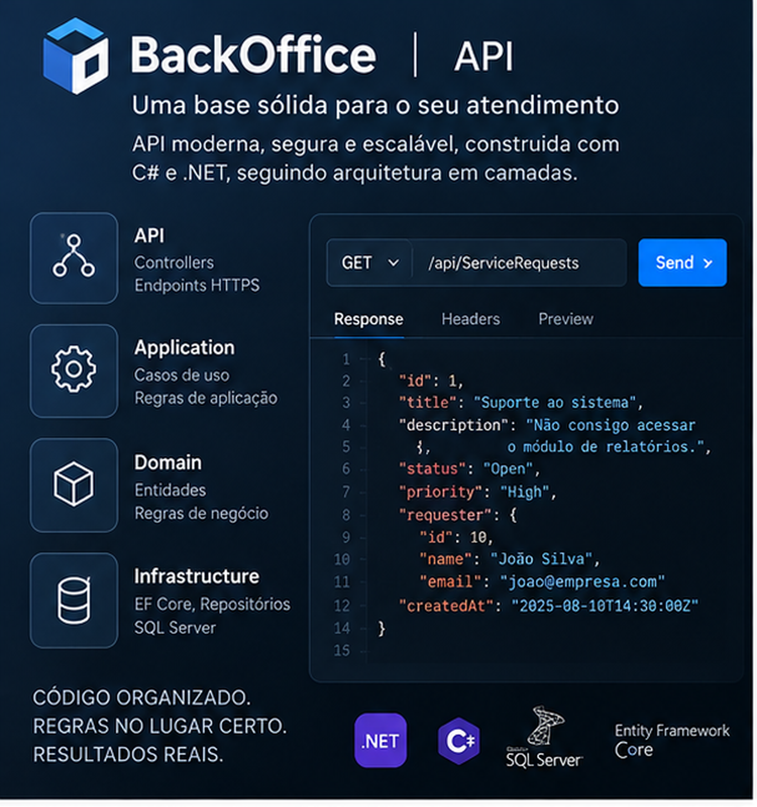

# BackOffice

Sistema de back-office para gerenciamento de solicitações, usuários e fluxos de atendimento, desenvolvido em C#/.NET com
arquitetura em camadas, persistência em SQL Server e testes automatizados.

O projeto foi estruturado para evoluir de uma API backend para uma solução completa de atendimento, composta por portal
web, aplicações mobile, autenticação e autorização, infraestrutura em nuvem e pipelines automatizados de integração e
entrega.

---

## Visão do produto

O **BackOffice** tem como objetivo centralizar o gerenciamento de solicitações e o fluxo de atendimento entre usuários,
atendentes e administradores.

A solução está sendo construída de forma modular para permitir sua evolução em diferentes interfaces sem acoplar as
regras de negócio à API, banco de dados ou aplicações clientes.

Visão final da plataforma:

```text
                         ┌─────────────────────┐
                         │      Usuários       │
                         └──────────┬──────────┘
                                    │
               ┌────────────────────┼────────────────────┐
               │                    │                    │
               ▼                    ▼                    ▼
        ┌─────────────┐      ┌─────────────┐      ┌─────────────┐
        │ Portal Web  │      │ App Mobile  │      │ App Mobile  │
        │ BackOffice  │      │ Atendente   │      │  Cliente    │
        └──────┬──────┘      └──────┬──────┘      └──────┬──────┘
               │                    │                    │
               └────────────────────┼────────────────────┘
                                    │
                                    ▼
                         ┌─────────────────────┐
                         │ ASP.NET Core Web API│
                         └──────────┬──────────┘
                                    │
                         ┌──────────▼──────────┐
                         │    Application      │
                         │     Use Cases       │
                         └──────────┬──────────┘
                                    │
                         ┌──────────▼──────────┐
                         │       Domain        │
                         │  Regras de negócio  │
                         └──────────┬──────────┘
                                    │
                         ┌──────────▼──────────┐
                         │   Infrastructure    │
                         │ EF Core / Serviços  │
                         └──────────┬──────────┘
                                    │
                                    ▼
                         ┌─────────────────────┐
                         │     SQL Server      │
                         └─────────────────────┘
```

---

## Status do projeto

| Área                           | Status                |
| ------------------------------ | --------------------- |
| Estrutura da solução           | ✅ Implementado       |
| Domain                         | ✅ Implementado       |
| Application                    | ✅ Implementado       |
| Infrastructure                 | ✅ Implementado       |
| ASP.NET Core Web API           | ✅ Implementado       |
| SQL Server                     | ✅ Implementado       |
| Entity Framework Core          | ✅ Implementado       |
| Migrations                     | ✅ Implementado       |
| Repository Pattern             | ✅ Implementado       |
| Dependency Injection           | ✅ Implementado       |
| Testes de domínio              | ✅ Implementado       |
| Testes de aplicação            | ✅ Implementado       |
| Testes de integração           | ✅ Implementado       |
| Usuários e perfis              | ✅ Implementado       |
| Hash de senha com PBKDF2       | ✅ Implementado       |
| Fluxo de login na Application  | 🚧 Em desenvolvimento |
| Autenticação HTTP              | 🚧 Em desenvolvimento |
| JWT                            | 🗺️ Planejado          |
| Autorização por perfil         | 🗺️ Planejado          |
| Portal Web                     | 🗺️ Planejado          |
| Aplicativo Mobile do atendente | 🗺️ Planejado          |
| Aplicativo Mobile do cliente   | 🗺️ Planejado          |
| Azure                          | 🗺️ Planejado          |
| CI/CD                          | 🗺️ Planejado          |

---

## Funcionalidades atuais



### Solicitações

A estrutura atual permite trabalhar com solicitações através das diferentes camadas do sistema.

Fluxo atual:

```text
HTTP Request
    ↓
Controller
    ↓
DTO
    ↓
Use Case
    ↓
Domain
    ↓
Repository
    ↓
Entity Framework Core
    ↓
SQL Server
```

A API possui operações para criação e consulta de solicitações.

```text
POST /api/ServiceRequests
GET  /api/ServiceRequests
```

---

### Usuários

O domínio possui gerenciamento de usuários com informações como:

```text
Id
Name
Email
Role
PasswordHash
```

Perfis disponíveis:

```text
Admin
Attendant
Requester
```

As regras relacionadas aos usuários permanecem no domínio, sem dependência direta da API ou do banco de dados.

---

### Autenticação

O fluxo de autenticação está sendo desenvolvido em etapas.

Estrutura atual:

```text
LoginInput
    ↓
LoginUseCase
    ↓
IUserRepository.GetByEmail()
    ↓
IPasswordHasher.Verify()
    ↓
User
    ↓
LoginResult
```

O sistema já possui:

```text
LoginInput
LoginResult
LoginUseCase
IPasswordHasher
PasswordHasher
PBKDF2
salt aleatório
comparação de hash em tempo constante
```

A próxima evolução desse fluxo inclui integração completa com a API, autenticação JWT e proteção dos endpoints.

---

## Segurança

A arquitetura foi preparada para impedir que responsabilidades de segurança sejam espalhadas pelas diferentes camadas do
sistema.

As senhas não devem ser armazenadas em texto puro.

O serviço de hash utiliza:

```text
PBKDF2
SHA-256
salt aleatório individual
hash derivado
comparação segura
```

Fluxo planejado de autenticação:

```text
E-mail + Senha
      ↓
AuthController
      ↓
LoginUseCase
      ↓
UserRepository
      ↓
PasswordHasher
      ↓
Validação das credenciais
      ↓
JWT
      ↓
Cliente autenticado
```

Posteriormente os perfis de usuário serão utilizados para autorização dos recursos disponíveis na aplicação.

---

## Arquitetura

O BackOffice utiliza uma arquitetura em camadas, separando regras de negócio, casos de uso, infraestrutura e comunicação
HTTP.

```text
BackOffice.Api
        │
        ▼
BackOffice.Application
        │
        ▼
BackOffice.Domain

BackOffice.Infrastructure
        │
        ▼
SQL Server
```

### BackOffice.Domain

Responsável pelo núcleo da aplicação.

Contém:

```text
Entidades
Enums
Regras de negócio
Validações de domínio
```

Não possui dependência de:

```text
ASP.NET Core
Entity Framework Core
SQL Server
Azure
Interface gráfica
```

---

### BackOffice.Application

Responsável pela execução dos casos de uso.

Contém:

```text
Use Cases
DTOs
Interfaces
Contratos de repositório
Contratos de serviços
```

Exemplos:

```text
CreateServiceRequestUseCase
ListServiceRequestsUseCase
LoginUseCase
IUserRepository
IServiceRequestRepository
IPasswordHasher
```

---

### BackOffice.Infrastructure

Responsável pelas implementações técnicas necessárias para executar os contratos definidos pelas demais camadas.

Contém:

```text
Entity Framework Core
DbContext
SQL Server
Repositories
Migrations
Database Seeder
PasswordHasher
Serviços técnicos
```

---

### BackOffice.Api

Responsável pela exposição HTTP da aplicação.

Contém:

```text
Controllers
Dependency Injection
Configuração da aplicação
Endpoints HTTP
Respostas da API
```

Os controllers permanecem enxutos e delegam a execução das regras para os casos de uso.

---

## Estrutura atual da solução

```text
BackOffice
│
├── src
│   │
│   ├── BackOffice.Api
│   │
│   ├── BackOffice.Application
│   │
│   ├── BackOffice.Domain
│   │
│   └── BackOffice.Infrastructure
│
├── tests
│   │
│   ├── BackOffice.Application.Tests
│   ├── BackOffice.Domain.Tests
│   └── BackOffice.Integration.Tests
│
├── BackOffice.slnx
├── README.md
└── LICENSE
```

---

## Persistência

A aplicação utiliza **SQL Server** como banco de dados relacional.

O acesso aos dados é realizado através do **Entity Framework Core**.

```text
Application
    ↓
Repository Interface
    ↓
Infrastructure
    ↓
EF Core Repository
    ↓
DbContext
    ↓
SQL Server
```

As alterações de estrutura do banco são controladas através de migrations.

O banco atualmente contém estruturas relacionadas a:

```text
Users
ServiceRequests
__EFMigrationsHistory
```

---

## Testes automatizados

O projeto possui atualmente **48 testes automatizados**.

A estratégia de testes é dividida em diferentes níveis:

```text
Domain Tests
     ↓
Regras de negócio isoladas

Application Tests
     ↓
Casos de uso e contratos

Integration Tests
     ↓
HTTP
Controllers
Dependency Injection
Application
Domain
Infrastructure
Entity Framework Core
```

O objetivo é garantir que alterações futuras possam ser realizadas com maior segurança e menor risco de regressão.

---

## Tecnologias

### Backend

```text
C#
.NET 10
ASP.NET Core Web API
Entity Framework Core
SQL Server
```

### Testes

```text
xUnit
Testes unitários
Testes de aplicação
Testes de integração
```

### Versionamento

```text
Git
GitHub
```

### Planejado

```text
JWT
.NET MAUI
Azure
GitHub Actions
CI/CD
```

---

## Roadmap

### Fase 1 — Backend

Base da plataforma e regras centrais.

```text
✅ Arquitetura em camadas
✅ Domain
✅ Application
✅ Infrastructure
✅ Web API
✅ SQL Server
✅ Entity Framework Core
✅ Repository Pattern
✅ Dependency Injection
✅ Migrations
✅ Database Seeder
✅ Service Requests
✅ Users
✅ User Roles
✅ PasswordHash
✅ PBKDF2
✅ LoginUseCase
🚧 Integração completa do serviço de senha
🚧 Endpoint de autenticação
🗺️ JWT
🗺️ Autorização
🗺️ Proteção de endpoints
🗺️ Tratamento global de erros
🗺️ Expansão das funcionalidades de atendimento
```

### Fase 2 — Portal Web

Interface administrativa para operação do BackOffice.

Planejado:

```text
Dashboard
Login
Gerenciamento de usuários
Gerenciamento de solicitações
Filtros
Pesquisa
Detalhes de atendimento
Controle por perfil
Indicadores
```

### Fase 3 — Mobile

Aplicações móveis integradas à mesma API.

#### Aplicativo do atendente

Planejado:

```text
Autenticação
Fila de solicitações
Detalhes da solicitação
Atualização de atendimento
Notificações
Histórico
```

#### Aplicativo do cliente

Planejado:

```text
Autenticação
Criação de solicitação
Acompanhamento
Histórico
Notificações
Perfil
```

A tecnologia planejada para os aplicativos é **.NET MAUI**.

---

### Fase 4 — Cloud

Evolução da solução para infraestrutura em nuvem.

Planejado:

```text
Azure
Hospedagem da API
Banco de dados em nuvem
Configuração por ambiente
Gerenciamento seguro de secrets
Logs
Monitoramento
Observabilidade
Backup
```

---

### Fase 5 — CI/CD

Automação do ciclo de desenvolvimento e publicação.

Fluxo planejado:

```text
Developer
    ↓
Git Commit
    ↓
GitHub
    ↓
GitHub Actions
    ↓
Restore
    ↓
Build
    ↓
Automated Tests
    ↓
Publish
    ↓
Deploy
```

A intenção é fazer com que alterações aprovadas passem automaticamente por build e testes antes de chegarem ao ambiente
publicado.

---

## Evolução da plataforma

A arquitetura permite que diferentes clientes utilizem o mesmo núcleo de negócio:

```text
                    BackOffice API
                         │
          ┌──────────────┼──────────────┐
          │              │              │
          ▼              ▼              ▼
         Web          Mobile         Integrações
          │              │              │
          └──────────────┼──────────────┘
                         │
                         ▼
                  Application
                         │
                         ▼
                     Domain
                         │
                         ▼
                 Infrastructure
                         │
                         ▼
                    SQL Server
```

Dessa forma, regras de negócio não precisam ser reimplementadas quando novas interfaces forem adicionadas.

---

## Princípios do projeto

O desenvolvimento do BackOffice busca manter:

```text
Separação de responsabilidades
Baixo acoplamento
Código testável
Controllers enxutos
Regras de negócio no domínio
Casos de uso na Application
Infraestrutura substituível
Dependency Injection
Persistência desacoplada
Testes automatizados
Versionamento incremental
Segurança desde a arquitetura
```

---

## Versionamento

O projeto utiliza Git com histórico incremental de alterações.

Padrão utilizado para commits:

```text
feat: nova funcionalidade
fix: correção
test: testes
refactor: refatoração
docs: documentação
chore: manutenção do projeto
```

A evolução do repositório acompanhará todas as etapas da plataforma:

```text
Backend
   ↓
Autenticação
   ↓
Web
   ↓
Mobile
   ↓
Cloud
   ↓
CI/CD
```

---

## Licença

Distribuído sob a licença **MIT**.

Consulte o arquivo `LICENSE` para mais informações.
